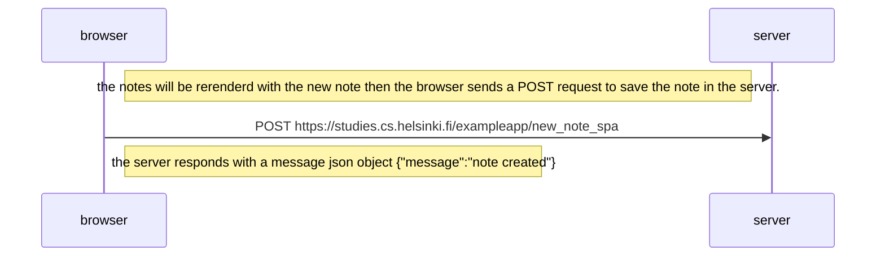

## when the user enter a new note and presses enter or save the following happens

```mermaid
sequenceDiagram
    participant browser
    participant server

    Note right of browser: the notes will be rerenderd with the new note then the browser sends a POST request to save the note in the server.

    browser->>server: POST https://studies.cs.helsinki.fi/exampleapp/new_note_spa

    Note right of browser: the server responds with a message json object {"message":"note created"}
```
